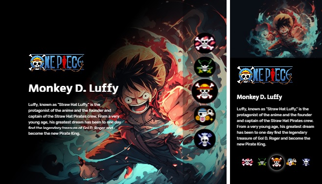

**Project**

One Piece Characters Page

**Description**
Welcome to the world of One Piece! Explore the fascinating crew members of the Straw Hat Pirates through our character profiles. Dive into the stories and backgrounds of some of the most beloved and iconic characters from this legendary anime and manga series.

**Resources**

The "One Piece Characters" webpage is a responsive, front-end web application designed to showcase and provide information about prominent characters from the popular anime and manga series, One Piece. It offers a visually engaging user interface where visitors can explore character profiles, complete with images, names, and detailed descriptions. The page also features navigation buttons for easy access to individual character profiles.

.Semantic HTML5
.CSS
.Vanilla Javascript
.Responsive Design - Desktop/Tablet/Mobile
.BEM Methodology

**Github Page**

Clique no link abaixo para visitar a página.

https://brunocarletti182.github.io/one_piece_page/

**Imagens do projeto**

